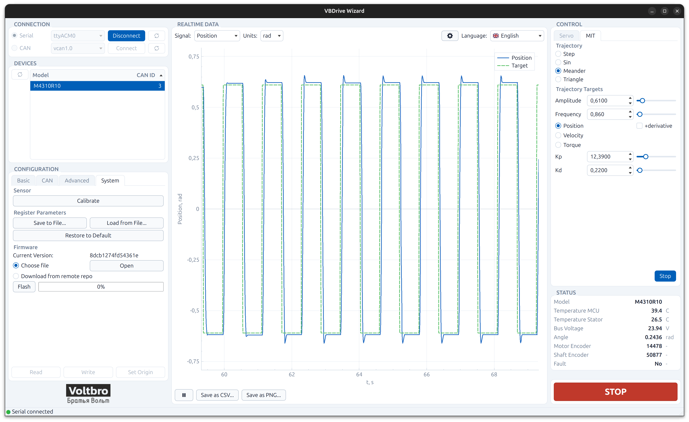

# VBDrive Wizard

VBDriveWizard — настольное GUI-приложение для удобного взаимодействия пользователя с
электроприводами [**VBDrive**](https://github.com/VBCores/VBDrive). Приложение служит для
базовой проверки и первичной настройки приводов.



Возможности:

- подключение к приводу по USB (serial) или по CAN (Cyphal), список найденных устройств;
- чтение и запись регистров привода (базовые, CAN, расширенные, системные), сохранение
  и загрузка профиля параметров в YAML, сброс к заводским значениям, калибровка датчика;
- график телеметрии в реальном времени (положение, скорость, ток, температура и т. д.)
  с выбором единиц измерения и экспортом в CSV/PNG;
- управление приводом: сервоуправление и MIT-режим, тестовые траектории (step, sin,
  meander, triangle), настройка Kp/Kd, аварийная кнопка STOP;
- обновление прошивки из файла или из последнего релиза VBDrive на GitHub;
- интерфейс на русском, английском и китайском, светлая и тёмная темы.

---

## Установка на Ubuntu 24.04

Приложение распространяется в виде `.deb`-пакета. Пакет собран под Ubuntu 24.04 LTS
(Qt 6.4); на более старых выпусках (22.04 и ниже) он не установится.

### 1. Скачайте пакет

Откройте страницу [Releases](https://github.com/VBCores/VBDriveWizard/releases) и скачайте
файл `vbdrivewizard_<версия>_amd64.deb` из последнего релиза, например
`vbdrivewizard_0.0.1_amd64.deb`. По умолчанию браузер сохраняет его в `~/Downloads`
(`~/Загрузки`).

### 2. Установите пакет

Откройте терминал (`Ctrl+Alt+T`) и выполните — `apt` сам подтянет Qt 6 и остальные
зависимости. Обратите внимание на `./` перед именем файла, без него `apt` будет искать
пакет в репозиториях, а не на диске:

```bash
cd ~/Downloads
sudo apt install ./vbdrivewizard_0.0.1_amd64.deb
```

Введите пароль своего пользователя, когда `sudo` его запросит, и подтвердите установку
клавишей `Y`.

### 3. Дайте себе доступ к USB-порту

Привод по USB виден в системе как последовательный порт (`/dev/ttyACM0`). Чтобы работать
с ним без `sudo`, пользователь должен состоять в группе `dialout`:

```bash
sudo usermod -aG dialout $USER
```

После этого **выйдите из системы и войдите снова** (или перезагрузите ПК) — членство в
группе применяется только при новом входе. Проверить, что всё сработало:

```bash
groups
```

В выводе должно присутствовать слово `dialout`.

### 4. Запустите приложение

Приложение появится в меню приложений под именем **VBDrive Wizard**. Его также можно
запустить из терминала:

```bash
VBDriveWizard
```

Подключите привод по USB, нажмите кнопку обновления списка портов, выберите
`ttyACM0` и нажмите **Connect**.

### Обновление

Скачайте `.deb` новой версии и установите его той же командой — старая версия будет
заменена:

```bash
sudo apt install ./vbdrivewizard_<новая-версия>_amd64.deb
```

### Удаление

```bash
sudo apt remove vbdrivewizard
```

Настройки пользователя (`~/.config/Voltbro/VBDriveWizard/`) и скачанные прошивки
(`~/.local/share/Voltbro/VBDriveWizard/firmwares/`) при этом не удаляются; при
необходимости удалите эти каталоги вручную.

---

## Сборка из исходников

Инструкция для разработчиков и для тех, кто хочет собрать пакет самостоятельно.
Проверено на Ubuntu 24.04.

### 1. Установите зависимости

```bash
sudo apt update
sudo apt install build-essential cmake ninja-build git pipx \
    qt6-base-dev qt6-serialport-dev qt6-tools-dev qt6-tools-dev-tools qt6-l10n-tools \
    libqt6svg6 libyaml-cpp-dev libgl1-mesa-dev dpkg-dev
```

Для генерации типов Cyphal нужен `nnvg` из пакета Nunavut. Он ставится через `pipx` в
`~/.local/bin` — убедитесь, что этот каталог есть в `PATH` (после `pipx ensurepath`
перезапустите терминал):

```bash
pipx install nunavut==2.3.1
pipx ensurepath
```

### 2. Получите исходники

```bash
git clone https://github.com/VBCores/VBDriveWizard.git
cd VBDriveWizard
```

Все сторонние библиотеки (`third_party/`) уже включены в репозиторий, ничего
дополнительно скачивать не нужно.

### 3. Соберите и запустите

```bash
cmake -S . -B build/release -G Ninja -DCMAKE_BUILD_TYPE=Release
cmake --build build/release
./build/release/VBDriveWizard
```

При запуске из каталога сборки приложение берёт `registers/`, `config.yaml` и
`firmwares/` прямо из дерева исходников — это удобно для разработки.

### 4. Соберите `.deb`-пакет

Пакет собирается с флагом `-DVBDRIVEWIZARD_DEV_PATHS=OFF`, чтобы установленный бинарник не
ссылался на каталог с исходниками, а использовал `/usr/share/VBDriveWizard`:

```bash
cmake -S . -B build/release -G Ninja -DCMAKE_BUILD_TYPE=Release -DVBDRIVEWIZARD_DEV_PATHS=OFF
cmake --build build/release
cpack --config build/release/CPackConfig.cmake -B build/release
```

Готовый файл появится в `build/release/vbdrivewizard_<версия>_amd64.deb`. Версия берётся из
`project(VBDriveWizard VERSION ...)` в `CMakeLists.txt`.

Проверить содержимое и метаданные пакета перед распространением:

```bash
dpkg -c build/release/vbdrivewizard_*.deb    # список файлов
dpkg -I build/release/vbdrivewizard_*.deb    # зависимости, описание
lintian build/release/vbdrivewizard_*.deb    # проверка на соответствие Debian policy (нужен пакет lintian)
```

### Автоматическая сборка (GitHub Actions)

Workflow [`.github/workflows/deb.yml`](.github/workflows/deb.yml) собирает пакет на чистой
Ubuntu 24.04, устанавливает его и проверяет запуск. Он запускается:

- автоматически при пуше тега вида `v*` — готовый `.deb` прикладывается к GitHub Release:

  ```bash
  git tag v0.0.1
  git push origin v0.0.1
  ```

  Перед этим убедитесь, что версия в `CMakeLists.txt` совпадает с тегом.

- вручную через вкладку **Actions → Debian package → Run workflow** — пакет будет доступен
  как артефакт сборки.
